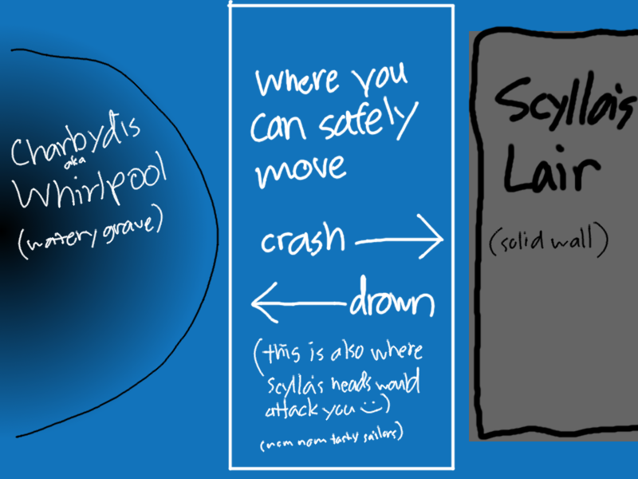

# Basic idea
The basic idea is to recreate the scenes with Scylla and Charybdis from *The Odyssey* in the form of a small and simple game.

> See [SOURCES.md](SOURCES.md) for various facts and information about the characters/location/story

## How will this all work?

Now, you may be wondering *what the heck is the image above all about?* Well, quite simply, this is my horridly awful attempt at depicting how the in-game layout will be. Based on descriptions from *The Odyssey* itself and various websites, as well as the actual Strait of Messina itself, you had to sail **right** between Scylla and Charybdis. Scylla would be on one side of you, while Charybdis was on the other, and if you got too close to either one, you would be either eaten or sucked into a vortex of water. 

So, my idea is to recreate that, putting Charybdis on one side, and Scylla on the other. According to the book ([thank you, SparkNotes](https://www.sparknotes.com/lit/odyssey/section7.rhtml)):

> As instructed by Circe, Odysseus holds his course tight against the cliffs of Scylla’s lair. As he and his men stare at Charybdis on the other side of the strait, the heads of Scylla swoop down and gobble up six of the sailors.

The basic rules of the game are as follows:

### Objective
Sail through the Strait of Messina safely with at least most of your crew intact
> You have 6 lives (the 6 sailors who were eaten by Scylla). To sail through the strait "safely", you need to have at least 1 of those lives left, and you need to have not crashed or been sucked into the whirlpool.

### Obstacles
- Scylla is constantly trying to eat you, so you have to try and dodge her 6 heads
  - Every time Scylla touches (like she's eating) you with one of her heads, you lose a "life" (one of the six sailors)
    - If you lose all six lives, you lose the game. Admittedly, this isn't entirely accurate to the book. You should lose all six sailors if you want to remain true to the story, but that wouldn't exactly make the game nearly as fun, now would it? :)
  - *Possibility:* Maybe her 12 feet could try and knock your boat around, not hurting you, but moving you around, which would make it even harder to dodge and stay away from Charybdis
- Crashing into the right side of the screen, which is Scylla's lair (giant cliffs), destroys your boat and you lose the game immediatly
- Going too far to the left side of the screen, the giant whirlpool that is Charybdis, sucks your boat down in and you lose the game immediatly
- Charybdis is constantly pulling you towards herself, making it even harder to dodge Scylla's heads, since you have less control over the movement of your boat
  - The closer you get to Charybdis, the harder the pull, which makes sense for a whirlpool
  - *Possibility:* It says Charybdis sometimes spews out the water which she is constantly sucking in. Maybe I could make it so that at some interval she spews out a burst of water, which -- rather than pulling you towards her -- would suddenly push you away towards Scylla's cliffs, possibly causing you to crash against the cliffs.

### Gameplay
You would move your boat left and right (and maybe forwards and backwards as well), while water is constantly rushing by you, indicating a forward movement (through the straight, of course). It would be time-based, requiring you to survive for however many seconds (which could be changed for varying difficulty levels).

What makes (or should I say "will make"?) this game difficult and replayable is the multiple layers of difficulty. You have to simultaneously dodge Scylla's heads, possibly avoid her feet as well, sail your boat against the pull of Charybdis, and maybe even have to suddenly sail in the opposite direction when Charybdis spews out a burst of water -- again, doing all of this while dodging Scylla's snapping heads.

### Final Comments
As for accuracy to the original accounts, there's only so much I can do. However, I've done my best to accurately set up the scene. When it comes time to make graphics, I will also do my best to portray the monsters/characters as accurately as I can, although there is very little given in terms of physical descriptions, especially for Scylla and Charybdis. I will also want to take a little bit of artistic license on the graphics, but it will still maintain any characteristics described by written accounts.

I intend for this game to have animations, sound effects, and music. Obviously I may be a bit limited on what I can do, since this is a project which has a set due-date, but I will do what I can.